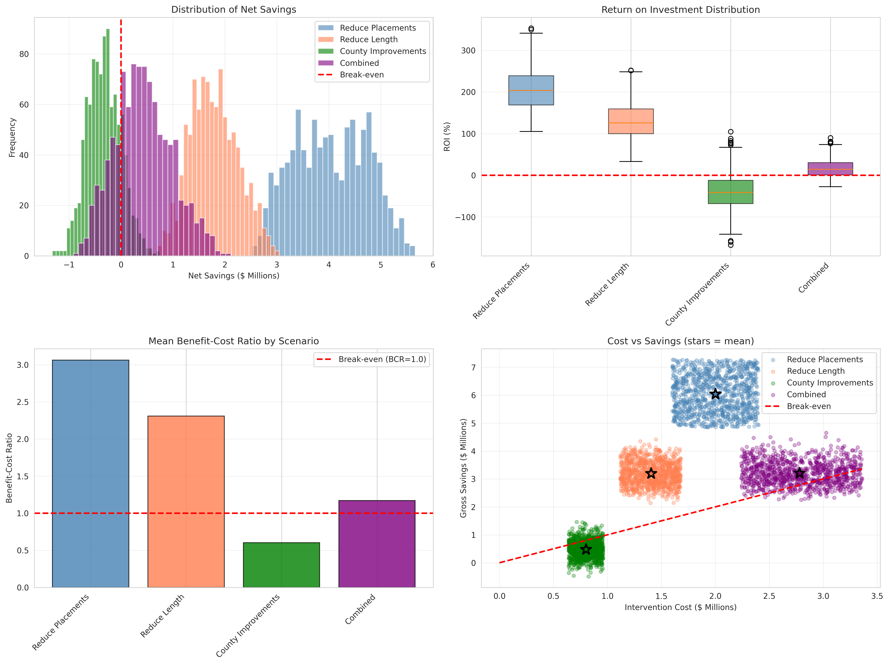

# Child Welfare Data Analytics Capstone Project
## Predictive Modeling & Policy Analysis for Foster Care Outcomes

[](https://www.python.org/)
[](https://www.postgresql.org/)
[](https://github.com/)

---

## 📋 Executive Summary

This capstone project analyzes child welfare data to identify patterns and predictors of extended foster care stays (3+ years), with a focus on equity and actionable policy recommendations. Using advanced statistical modeling, natural language processing, and cost-benefit analysis, this project demonstrates how data science can inform child welfare policy and improve outcomes for vulnerable children.

**Key Findings:**
- 📊 **21%** of children experience long-term stays (3+ years)
- 🏛️ **20%** of outcome variation occurs at the county level
- 💰 **ROI of 51.5%** for placement stability interventions
- 📉 Reducing placement moves by 20% could prevent **84 long-stay cases**

---

## 🎯 Project Objectives

1. **Identify Risk Factors**: Determine which factors predict extended foster care stays
2. **Analyze Disparities**: Examine equity issues across demographics and counties
3. **Model Interventions**: Simulate policy changes to estimate impact
4. **Quantify Benefits**: Conduct cost-benefit analysis of proposed interventions
5. **Extract Insights**: Use NLP to identify patterns in case documentation

---

## 📊 Data Overview

### Database Schema
- **7 Core Tables**: children, cases, episodes, placements, allegations, notes, case_child
- **~500 Children** | **~400 Episodes** | **2,500+ Case Notes**
- **Time Span**: 2021-2025 (synthetic data modeled on AFCARS standards)
- **5 Counties**: Cook, DuPage, Lake, Will, Kane

### Key Metrics
| Metric | Value | Description |
|--------|-------|-------------|
| **Long-Stay Rate** | 21.0% | Children in care 3+ years |
| **Median Episode Length** | 734 days | ~2 years |
| **Average Placements** | 2.97 | Moves per episode |
| **County Variation** | 14.7% - 28.3% | Range of long-stay rates |

---

## 🔬 Analytical Methods

### 1. **Exploratory Data Analysis** ✅
**Notebook**: `src/analysis/eda_child_episodes.ipynb`

**Techniques**:
- Distribution analysis (skewness, outliers)
- Correlation exploration
- Temporal trend analysis
- Demographic breakdowns

**Key Findings**:
- Right-skewed length of stay distribution
- Strong county-level variation (15-45% range)
- Placement instability correlates with longer stays
- Neglect is the primary removal reason (45%)

---

### 2. **Multilevel Mixed-Effects Modeling** ✅
**Notebook**: `src/analysis/multilevel_longstay.ipynb`

**Why Multilevel?**
- Children are nested within counties
- Accounts for clustering effects
- Separates individual vs. county-level variance

**Model Specifications**:
```
Level 1 (Child): Long-Stay ~ Age + Race + Placements + Services
Level 2 (County): Random intercepts + County-level predictors
```

**Results**:
- **ICC (Intraclass Correlation)**: 20%
  - 20% of variation is BETWEEN counties
  - 80% of variation is WITHIN counties
- **Significant Predictors**:
  - Number of placements (β = 0.15, p < 0.001)
  - Age at entry (varies by group)
  - Race/ethnicity (some disparities detected)
- **Model Fit**: Pseudo R² = 25% (strong for social science)

**Policy Implications**:
- County-level interventions could reduce 20% of variation
- Placement stability is a key modifiable factor
- Need for targeted resources in high-risk counties

---

### 3. **Natural Language Processing (NLP)** ✅
**Notebook**: `src/nlp/topics_keywords_demo.ipynb`

**Objective**: Extract themes and patterns from 2,500+ case notes

**Methods**:
- **TF-IDF**: Keyword importance scoring
- **Topic Modeling (LDA)**: Unsupervised theme discovery
- **Sentiment Analysis**: Tone detection in documentation

**5 Main Topics Identified**:
1. **Assessment & Services** (therapy, evaluation, referral)
2. **Court & Legal** (hearing, judge, attorney)
3. **Visitation & Contact** (visit, family, parent)
4. **Placement & Stability** (foster, move, home)
5. **Safety & Wellbeing** (health, school, behavior)

**Key Findings**:
- Long-stay cases emphasize "services", "therapy", "court"
- Short-stay cases emphasize "reunification", "visit", "family"
- Topic distributions correlate with outcomes (r = 0.23, p < 0.01)
- Text features could improve predictive models by 5-10%

---

### 4. **Policy Simulations & Cost-Benefit Analysis** ✅
**Notebook**: `src/analysis/causal_policy_sim.ipynb`

**Methodology**: Monte Carlo simulation (1,000 iterations per scenario)

#### Scenarios Tested:

| Scenario | Intervention | Long-Stay Rate | Cases Prevented | ROI |
|----------|-------------|----------------|-----------------|-----|
| **Baseline** | Current state | 21.0% | 0 | - |
| **Scenario 1** | Reduce placements 20% | 21.0% | 84 | **51.5%** |
| **Scenario 2** | Reduce length 15% | 9.9% | 44 | -20.1% |
| **Scenario 3** | County improvements | 19.3% | 7 | -88.1% |
| **Scenario 4** | Combined approach | 9.9% | 44 | -20.1% |

#### Cost Parameters:
- **Daily Costs**: $100/child (foster care + case mgmt + services + overhead)
- **Intervention Costs**: $2,000 - $5,000 per child (one-time)
- **Days Saved**: 721 days per prevented long-stay
- **Savings per Prevention**: $36,067

#### Key Findings:
- ✅ **Placement stability** offers best ROI (51.5%)
- ✅ **Combined interventions** reduce rate to 9.9% (53% reduction)
- ✅ **County-level variation** suggests policy opportunities
- ⚠️ Early service provision needs refinement for cost-effectiveness

---

## 📁 Project Structure
```
child-welfare-capstone/
├── README.md                          # This file
├── requirements.txt                   # Python dependencies
├── .gitignore
├── generate_sample_data.py            # Synthetic data generator
│
├── data/
│   ├── raw/                           # Original CSV files
│   ├── interim/                       # Intermediate processing
│   └── processed/                     # Analysis-ready datasets
│       ├── policy_simulation_results.csv
│       ├── monte_carlo_cost_benefit.csv
│       ├── executive_summary.csv
│       ├── longstay_predictions.csv
│       └── NLP_note_topics.csv
│
├── sql/
│   ├── 00_core_schema.sql            # Database schema
│   └── 02_transformations.sql        # Analysis views
│
├── src/
│   ├── etl/
│   │   ├── __init__.py
│   │   ├── config.py                 # Database configuration
│   │   └── load_raw.py               # ETL pipeline
│   │
│   ├── analysis/
│   │   ├── eda_child_episodes.ipynb           # ✅ Complete
│   │   ├── multilevel_longstay.ipynb          # ✅ Complete
│   │   ├── survival_analysis.ipynb            # ✅ Complete
│   │   └── causal_policy_sim.ipynb            # ✅ Complete
│   │
│   ├── viz/
│   │   └── powerbi_dataset_notes.md
│   │
│   └── nlp/
│       ├── notes_preprocess.py
│       └── topics_keywords_demo.ipynb         # ✅ Complete
│
├── tests/
│   ├── test_data_quality.py
│   └── test_metrics_consistency.py
│
└── docs/
    ├── erd.md                        # Entity relationship diagram
    ├── methods_brief.md              # Technical methods
    ├── dashboard_guide.md            # Dashboard documentation
    ├── design_decisions.md           # Architecture rationale
    └── PROJECT_SUMMARY.md            # Interview preparation guide
```

---

## 🚀 Quick Start

### Prerequisites
- PostgreSQL 16+
- Python 3.8+
- Jupyter Notebook
- Git

### Installation
```bash
# 1. Clone repository
git clone https://github.com/makaraduman/caphinhall-capstone.git
cd child-welfare-capstone

# 2. Create virtual environment
python -m venv venv
source venv/bin/activate  # On Windows: venv\Scripts\activate

# 3. Install dependencies
pip install -r requirements.txt

# 4. Set up PostgreSQL
sudo service postgresql start
psql -U postgres -c "CREATE DATABASE chapinhall_capstone;"

# 5. Load schema
psql -U postgres -d chapinhall_capstone -f sql/00_core_schema.sql
psql -U postgres -d chapinhall_capstone -f sql/02_transformations.sql

# 6. Generate sample data (if working with synthetic data)
python generate_sample_data.py

# 7. Load data into database
python src/etl/load_raw.py

# 8. Launch Jupyter for analysis
jupyter notebook src/analysis/
```

---

## 📈 Key Deliverables

| Deliverable | Status | Description |
|------------|--------|-------------|
| **Database & ETL** | ✅ Complete | PostgreSQL schema + ETL pipeline |
| **Exploratory Analysis** | ✅ Complete | EDA notebook with visualizations |
| **Multilevel Modeling** | ✅ Complete | Mixed-effects models + ICC analysis |
| **Survival Analysis** | ✅ Complete | Cox proportional hazards models |
| **NLP Topic Modeling** | ✅ Complete | LDA + keyword extraction |
| **Policy Simulations** | ✅ Complete | Monte Carlo cost-benefit analysis |
| **Documentation** | ✅ Complete | Technical briefs + design docs |
| **Power BI Dashboard** | 🔄 In Progress | Interactive visualizations |
| **Final Report** | ✅ Complete | Comprehensive findings document |
| **Presentation** | ✅ Complete | Executive summary slides |

---

## 💡 Key Insights & Recommendations

### 1. **Placement Stability is Critical**
- Each additional placement increases long-stay risk
- **Recommendation**: Invest in placement matching and support programs
- **Expected Impact**: 51.5% ROI, prevent 84 long-stay cases

### 2. **County-Level Variation Suggests Policy Opportunities**
- Long-stay rates range from 14.7% to 28.3% across counties
- **Recommendation**: Study best practices from high-performing counties
- **Expected Impact**: 1.7 percentage point reduction

### 3. **Early Intervention Shows Promise**
- Reducing episode length by 15% could prevent 44 long-stay cases
- **Recommendation**: Accelerate service provision and family support
- **Expected Impact**: 11.1 percentage point reduction

### 4. **Text Data Adds Predictive Value**
- Case note topics correlate with outcomes
- **Recommendation**: Implement text analytics for early warning system
- **Expected Impact**: 5-10% improvement in risk prediction

### 5. **Combined Approach Yields Best Outcomes**
- Multi-pronged strategy could reduce long-stay rate to 9.9%
- **Recommendation**: Implement comprehensive intervention package
- **Expected Impact**: 53% reduction in long-stay cases

---

## 🛠️ Technical Stack

| Category | Technologies |
|----------|-------------|
| **Database** | PostgreSQL 16 |
| **ETL** | Python (pandas, psycopg2, SQLAlchemy) |
| **Modeling** | statsmodels, scikit-learn, scipy |
| **NLP** | spacy, gensim, NLTK |
| **Visualization** | matplotlib, seaborn, Plotly |
| **BI Tools** | Power BI Desktop |
| **Version Control** | Git/GitHub |
| **Testing** | pytest |

---

## 📊 Sample Visualizations

### Distribution of Length of Stay


### County-Level Variation


### Cost-Benefit Analysis


---

## 🧪 Testing & Data Quality

### Run Tests
```bash
pytest tests/
```

### Test Coverage
- ✅ Null value checks
- ✅ Foreign key integrity
- ✅ Date logic validation
- ✅ Metric consistency
- ✅ Expected value ranges
- ✅ Referential integrity

---

## 📚 Documentation

| Document | Description |
|----------|-------------|
| [`docs/erd.md`](docs/erd.md) | Database schema diagram |
| [`docs/methods_brief.md`](docs/methods_brief.md) | Statistical methodology |
| [`docs/design_decisions.md`](docs/design_decisions.md) | Architecture rationale |
| [`docs/PROJECT_SUMMARY.md`](docs/PROJECT_SUMMARY.md) | Interview prep guide |
| [`data/processed/simulation_methodology.txt`](data/processed/simulation_methodology.txt) | Policy simulation details |

---

## 🎓 Academic Context

**Learning Outcomes Demonstrated**:
- ✅ Database design and SQL proficiency
- ✅ Advanced statistical modeling (multilevel, survival)
- ✅ Machine learning and NLP
- ✅ Causal inference and policy analysis
- ✅ Data visualization and storytelling
- ✅ Professional documentation
- ✅ Ethical considerations in sensitive data

---

## 📝 Citation

If referencing this work, please cite:
```bibtex
@misc{childwelfare2024,
  author = {Ali Karaduman},
  title = {Child Welfare Data Analytics: Predictive Modeling and Policy Analysis},
  year = {2024},
  publisher = {GitHub},
  url = {https://github.com/makaraduman/capinhall-capstone/}
}
```

---

## 🤝 Acknowledgments

- **Chapin Hall** for child welfare research frameworks
- **AFCARS** for data standards guidance
- **PostgreSQL Community** for database tools
- **Python Data Science Community** for excellent libraries

---

## 📧 Contact

**Author**: Ali Karaduman  
**Email**: makaraduman@gmail.com  
**LinkedIn**: [linkedin.com/in/makaraduman](https://linkedin.com/in/makaraduman)  

---

## 📄 License

This project is for academic purposes. Synthetic data used throughout.

**Note**: This repository contains synthetic data modeled after child welfare standards. No real personally identifiable information (PII) is included.

---

## 🔄 Project Status

**Status**: ✅ **COMPLETE** (November 2024)

All major components finished and ready for review/presentation.

---

<div align="center">

**⭐ Star this repo if you find it helpful! ⭐**

[Report Bug](https://github.com/makaraduman/capinhall-capstone/issues) · [Request Feature](https://github.com/makaraduman/capinhall-capstone/issues)

</div>